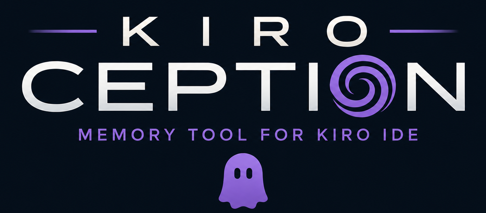

# Kiro Ception

<p align="center">
  
</p>

<p align="center">
  <a href="https://github.com/DevOps-Nirvana/Kiro-Ception">GitHub</a> •
  <a href="https://github.com/DevOps-Nirvana/Kiro-Ception/issues">Issues</a> •
  <a href="https://github.com/DevOps-Nirvana/Kiro-Ception/releases">Releases</a>
</p>

**Your AI now remembers everything you've ever done with it, across every machine you own.** Finally, an elephant-grade memory for your coding assistant, minus the 12,000-pound footprint.

Kiro Ception gives Kiro a long-term memory, persistent recall that spans every session, every window, CLI and IDE, and even across multiple machines. Your agent remembers what you discussed yesterday, last month, or six months ago, in any project, on any computer you work from. It automatically indexes all conversation history in the background and provides instant hybrid search (semantic + keyword) so you can find past discussions, decisions, and implementations by meaning, keywords, date, or any combination.

> *"We discussed this already..."*
> *"What was that approach we used last week?"*
> *"Didn't we solve this exact problem in the other project?"*
> *"How did I usually set up CI pipelines?"*
>
> - All things you can now just *ask*, and actually get an answer.

## How It Works

Kiro Ception is an [MCP Power](https://kiro.dev/docs/powers/) that runs as a background service alongside your Kiro IDE. It:

1. **Discovers** all Kiro CLI and IDE session files on your machine
2. **Extracts** meaningful messages (filtering out system prompts and boilerplate, condensing long code blocks into `[code:lang]` placeholders)
3. **Embeds** each message into a vector representation using your configured model
4. **Indexes** everything into an in-memory numpy matrix for instant hybrid search (semantic + FTS5 keyword)
5. **Serves** search results via MCP tools that Kiro can call naturally during conversation
6. **Federates** across machines, search your laptop and desktop simultaneously with encrypted peer-to-peer queries

Sessions are processed **newest first**, so your most recent conversations are searchable within seconds of startup, even while older history is still being indexed in the background.

Search results include surrounding context (messages before/after each match), relevance scores, workspace origin, and pagination, so Kiro gets the full picture of what was discussed.

### Architecture Highlights

- **Non-blocking**: Heavy work (indexing, embedding) runs in background daemon threads. The MCP server responds instantly.
- **Hybrid search**: Combines semantic vector similarity (70%) with FTS5 full-text keyword search (30%). Find things by meaning *and* exact names.
- **Recency-aware**: Recent conversations rank higher automatically. The decay curve scales with your history depth, no manual tuning.
- **Multi-window efficient**: Leader-follower pattern means multiple Kiro windows share one index in RAM. No duplication, no conflicts.
- **Multi-machine**: Optional peer federation searches across all your computers simultaneously with AES-256-GCM encrypted transport.
- **Crash-safe**: SQLite with WAL mode. Lose at most one in-flight message on Ctrl+C/crash/quit.
- **Instant cold-start**: Loads from existing cache in under 1 second. No waiting for re-indexing after restarts.
- **Auto-migrating**: Schema upgrades run automatically on startup, updates never require deleting your cache, future-proofing this tool.
- **Observable**: Built-in status dashboard, indexing progress monitoring, hot-reloadable config, and health diagnostics, all accessible to the agent or via browser.

## Installation

### Prerequisites

- **[Kiro](https://kiro.dev/downloads/)** - the AI-powered IDE
- **[Git](https://git-scm.com/downloads)** - for cloning/updating the power
- **Python 3.11+** (3.12, 3.13 also supported and tested officially)
- **[uv](https://docs.astral.sh/uv/getting-started/installation/)** - fast Python package manager

### Install as a Kiro Power from Local Clone (Recommended)

Clone the repo and install as a local power. This gives you immediate updates via `git pull` and the full Power experience (keyword triggers, automatic activation, POWER.md guidance):

```bash
git clone https://github.com/DevOps-Nirvana/Kiro-Ception.git
cd Kiro-Ception
uv sync
```

Then in Kiro IDE: Powers panel → **Add power from Local Path** → select the `Kiro-Ception` folder you just cloned.

To update later:

```bash
cd Kiro-Ception
git pull
uv sync
```

Kiro picks up changes on the next MCP server restart, either in the form of you restarting Kiro, or you can "disable" the MCP tool and re-enable it.

### Install as a Kiro Power from GitHub (Alternative)

If you prefer not to manage a local clone:

1. In Kiro IDE: Powers panel → **Add power from GitHub**
2. Enter: `https://github.com/DevOps-Nirvana/Kiro-Ception`
3. Click Install

> **Note:** Due to current bugs in how Kiro handles MCP servers within Powers installed from GitHub, the local clone method above is more reliable. The GitHub install may have issues with server startup or reconnection and/or with updating due to a possible split-brain scenario.

### Manual MCP Setup (Last Resort)

If you prefer manual configuration without the Power wrapper, add to your Kiro MCP configuration (`~/.kiro/settings/mcp.json`):

> **Warning:** Installing as a Power (above) is strongly recommended. The POWER.md file contains keyword triggers and usage guidance that help Kiro automatically activate search when you reference past conversations. With MCP-only setup, you'll need to explicitly ask Kiro to search history — it won't trigger on its own from phrases like "as we discussed" or "what did we do last time".

```json
{
  "mcpServers": {
    "kiro-ception": {
      "command": "uv",
      "args": ["tool", "run", "--from", "git+https://github.com/DevOps-Nirvana/Kiro-Ception", "kiro-ception"]
    }
  }
}
```

This uses `uv tool run` to fetch and run the package directly from GitHub, no local clone needed.

Alternatively, if you've cloned the repo locally:

```json
{
  "mcpServers": {
    "kiro-ception": {
      "command": "/path/to/Kiro-Ception/.venv/bin/kiro-ception"
    }
  }
}
```

Replace `/path/to/Kiro-Ception` with the actual clone location. Usually just saving your mcp config will do it, but if needed, restart Kiro.

## Configuration

Create `~/.config/kiro-ception/config.toml` to customize behavior. If this file doesn't exist, sensible defaults are used (local CPU-based embeddings with `all-MiniLM-L6-v2`).  Query the tool `get_config` for full information on your file location(s) for your config and database.

A full annotated default config is in [`config.default.toml`](config.default.toml); copy it as a starting point:

```bash
mkdir -p ~/.config/kiro-ception
cp config.default.toml ~/.config/kiro-ception/config.toml
```

### Minimal Config (Zero Setup)

With no config file at all, Kiro Ception uses:

- **Backend**: `sentence-transformers` (local, CPU-based, no API/GPU needed)
- **Model**: `all-MiniLM-L6-v2` (384 dimensions, ~80MB download on first run)
- **Sources**: Auto-discovers Kiro CLI and IDE conversations in both old and new formats
- **Memory**: Uses up to 1/3 of available RAM for the index (by default)

This is a good starting point; it runs entirely on CPU with no external dependencies.

### GPU-Accelerated with Ollama (Recommended for Power Users)

If you have Ollama running with a GPU, you can use much larger, higher-quality embedding models by putting something like the following in your config file:

```toml
[embedding]
backend = "openai-compatible"
model = "qwen3-embedding:4b"
api_base = "http://localhost:11434/v1"
dimensions = 1024
batch_size = 1
```

**Setup:**

```bash
# Install Ollama (if not already): https://ollama.com
ollama pull qwen3-embedding:4b
```

This gives significantly better search quality than MiniLM, especially for nuanced queries. The `4b` model runs comfortably on a 6GB+ GPU and indexes at ~3–5 messages/second.

### OpenAI / Hosted Providers

```toml
[embedding]
backend = "openai-compatible"
model = "text-embedding-3-large"
api_base = "https://api.openai.com/v1"
api_key = "sk-..."
dimensions = 1024
```

### LM Studio

```toml
[embedding]
backend = "openai-compatible"
model = "your-model-name"
api_base = "http://localhost:1234/v1"
dimensions = 768
```

## MCP Tools

Kiro can call these tools naturally during conversation:

| Tool | Purpose |
|------|---------|
| `search_project_history` | Search conversations scoped to the current workspace |
| `search_global_history` | Search across all workspaces (supports `source` filter: all/cli/ide) |
| `get_indexing_status` | Check indexer progress, rate, errors, ETA |
| `rescan` | Trigger a rescan for new sessions (`full=True` to re-read everything) |
| `get_config` | Show effective config, paths, cache stats, instance role, etc |
| `reload_config` | Hot-reload config from disk without requiring restart of Kiro |

### Search Parameters

Both search tools accept:

| Parameter | Default | Description |
|-----------|---------|-------------|
| `query` | *(required)* | Natural language search query |
| `after` | — | Only messages on/after this date (ISO 8601) |
| `before` | — | Only messages before this date (ISO 8601) |
| `context_size` | 3 | Messages before/after each match to include |
| `threshold` | 0.2 | Minimum similarity score (0–1) |
| `max_results` | 10 | Maximum results to return |
| `offset` | 0 | Skip results for pagination |

## Technologies & Libraries

| Component | Library | Purpose |
|-----------|---------|---------|
| MCP Server | [mcp](https://github.com/modelcontextprotocol/python-sdk) (FastMCP) | Exposes tools to Kiro via Model Context Protocol |
| Embedding (local) | [sentence-transformers](https://www.sbert.net/) | Local CPU/GPU embeddings (default: all-MiniLM-L6-v2) |
| Embedding (API) | [requests](https://docs.python-requests.org/) | OpenAI-compatible HTTP API for Ollama/LM Studio/OpenAI |
| Vector Search | [numpy](https://numpy.org/) | In-memory cosine similarity via dot product |
| Data Models | [Pydantic](https://docs.pydantic.dev/) | Typed data validation and serialization |
| Cache | SQLite (stdlib) | Persistent embedding + metadata storage (WAL mode) |
| Process Coordination | [filelock](https://py-filelock.readthedocs.io/) | Leader-follower election via file locks |
| Encryption | [cryptography](https://cryptography.io/) + [argon2-cffi](https://argon2-cffi.readthedocs.io/) | AES-256-GCM peer encryption with Argon2id key derivation |
| Build | [hatchling](https://hatch.pypa.io/) | PEP 517 build backend |
| Package Manager | [uv](https://docs.astral.sh/uv/) | Fast dependency resolution and venv management |
| Linter/Formatter | [ruff](https://docs.astral.sh/ruff/) | Linting and formatting |
| Tests | [pytest](https://pytest.org/) | Test framework (300 tests) |

## Optional Features

### Peer Federation

Search across multiple machines (e.g., your laptop + desktop). Each machine runs its own independent index. When you search, queries fan out to all peers in parallel and results are merged.

```toml
[peers]
enabled = true
nodes = ["192.168.1.50:19742", "workpc.tailscale:19742"]
secret = "my-shared-passphrase"  # Optional: encrypts all peer traffic with AES-256-GCM
timeout_seconds = 5
```

Peers communicate over HTTP. If `secret` is set, payloads are encrypted with AES-256-GCM (key derived via Argon2id from the passphrase). Both machines must use the same secret. Without a secret, traffic is plaintext; fine on VPNs or Tailscale or when local-only at your own house (up to you).

### Memory Limits

Control how much RAM the index uses:

```toml
[memory]
fraction = 0.33     # Use up to 1/3 of RAM (default)
# limit_mb = 512    # Or set an explicit limit
# limit_mb = 0      # Disable limit (use all available)
```

### Indexing Throttle

Reduce GPU/CPU load during active work:

```toml
[indexing]
throttle_ms = 5000   # Sleep 5000ms (5 seconds) between embedding batches (default: 0)
rescan_interval_minutes = 10  # Check for new sessions every 10 minutes (this is the default)
```

Once your initial index is built, it can be quite nice to add the throttle_ms value of 5-10 seconds (5000-10000) to ensure your computer runs quickly and your usage is not negatively affected.  This is especially valuable if you are using a large local GPU-based model.

Secondarily, if you are trying to be sparing on battery life, and/or if you don't care about getting your index up to date so quickly, you can greatly increase the rescan interval to 60 minutes, OR you can disable this automated rescan/reindexing process by setting this to 0.


## Performance

| Metric | Value |
|--------|-------|
| First-time indexing (MiniLM, CPU) | ~4 minutes (4300+ sessions) |
| First-time indexing (Qwen3-Embedding:4b, GPU) | ~35 minutes (4300+ sessions) |
| Subsequent startups | <2 seconds |
| Search latency | <10ms |
| Index refresh (backgrounded) | Every 60 seconds |
| Periodic rescan to update indexes (backgrounded) | Every 10 minutes |
| Embedding rate (Qwen3-Embedding:4b) | ~3–5 messages/second |

**Indexing order:** Sessions are indexed **newest first**, so your most recent conversations become searchable within seconds of startup. Older conversations fill in progressively in the background.

## Troubleshooting

### "Backend not ready" or "still loading"

On first startup, the index eagerly loads from SQLite into RAM. If embeddings exist but metadata hasn't populated yet, you'll see a "still loading" message. Retry in a few seconds.  Also, as your size of your embeddings increases this may make it take a little longer.  I have six months of Kiro work across 4300 chat documents with an (currently) 300MB embedding db, and it takes 10-15 seconds to load the index into RAM.

### Empty search results

- Check `get_indexing_status`; indexing may still be in progress
- Use `rescan()` to immediately pick up recent conversations
- Verify your config with `get_config`
- Check "Kiro Powers / MCP" log

### Embedding errors / timeouts

- For Ollama: ensure it's running (`ollama ps`) and the model is pulled
- Very long messages (>50K chars) may timeout; they're skipped with a warning
- Check your "Kiro Powers" outputs for logs/errors

### Config changes not taking effect

- Use `reload_config` tool (applies safe changes immediately)
- Model/backend/dimensions changes require `rescan(full=True)`

### Multiple windows fighting

The leader-follower pattern handles this automatically. Use `get_config` to see which process is leader. If a leader dies, the next request attempts to auto-promote a follower.

### Nuclear option

If the database is corrupt or everything is broken, find your file path to your database calling the `get_config` tool.  Then, once you find it, uninstall this power (or disable the MCP) then remove your database, then reinstall this power (or re-enable MCP).

```bash
rm -rf ~/.cache/kiro-ception/
```

When you Restart Kiro (or re-enable  MCP) it will rebuild the embeddings database from scratch.

## Development

```bash
uv sync                         # Install deps
uv run pytest tests/ -q         # Run tests (300, ~30s)
uv run ruff check src/          # Lint
uv run kiro-ception             # Run MCP server locally
```

## Data Locations

For information about where your data is being kept, call the MCP tool "get_config".  On an unix-ey system, the file(s) at are...

| Path | Contents |
|------|----------|
| `~/.config/kiro-ception/config.toml` | User configuration |
| `~/.cache/kiro-ception/cache_<hash>.db` | SQLite database (embeddings, metadata) |
| `~/.cache/kiro-ception/leader.lock` | Leader election file lock |
| `~/.cache/kiro-ception/leader.json` | Leader port/PID info for followers |

The cache DB filename includes a hash of the backend configuration. Changing model/backend/dimensions creates a new DB file (old ones are preserved for rollback).

**Privacy:** All data is processed and stored locally on your machine. No telemetry, no external API calls, and no data leaves your device; unless you explicitly configure a third-party embedding provider (e.g., OpenAI). The default configuration uses fully local, offline embeddings.

## Support

Found a bug? Have a feature request? [Open an issue](https://github.com/DevOps-Nirvana/Kiro-Ception/issues) on GitHub.

## License

MIT - See: [LICENSE](LICENSE).

## Attribution

Built by [Farley Farley](https://github.com/AndrewFarley) ([DevOps-Nirvana](https://github.com/DevOps-Nirvana)), based upon [Kiro Total Recall](https://github.com/danilop/kiro-total-recall) by Danilo Poccia (MIT licensed). The original session loaders, data models, and core embed/search concept originate from that project. Kiro Ception is a ground-up rewrite for production use; see the Architecture Highlights above for what's different.